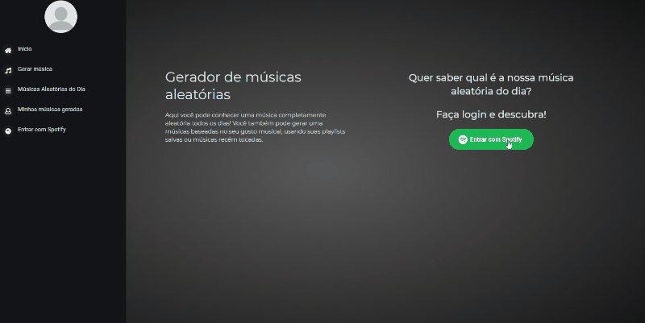
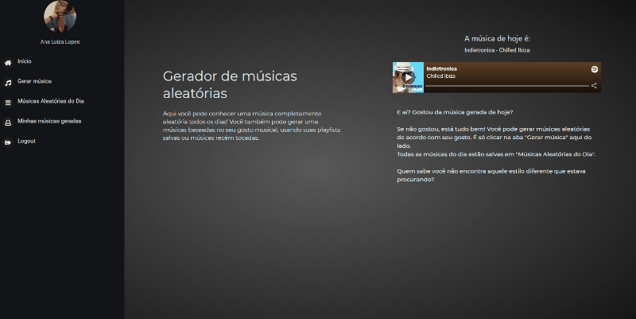

# Gerador de músicas

## Descrição

Sabe aquelas horas que a gente está cansado de escutar as mesmas playlists ou quer conhecer músicas completamente diferentes?

Se você conhece esse sentimento, o Gerador de músicas aleatórias pode te ajudar.\
Com ele você pode gerar músicas baseadas nas suas playlits salvas ou músicas recém ouvidas.\
Você ainda pode acessar nossa playlist de músicas completamente aleatórias que são geradas todos os dias!\
Só fazer o login com seu Spotify e começar a gerar suas músicas!\
Link: https://random-music-generator.herokuapp.com/

## Sobre o Projeto

A interface do Gerador de Músicas foi feita com React (Redux), CSS e JavaScript.\
O backend foi desenvolvido com NodeJS (Express) e MongoDB (mongoose) como banco de dados.\
Esta aplicação utiliza de cookies para identificação de dados do usuário.

## Preview

*Música aleatória do dia na página inicial.*\
\

*Gerar música baseada na playlist selecionada e acessar playlist de músicas geradas.*\

## Contato

Este projeto foi desenvolvido por Ana Luiza Lopes, Desenvolvedora de Software\
Contatos:\
analuizalopes.oliveira@gmail.com\
[linkedin.com/in/analu-lopes-oliveira](linkedin.com/in/analu-lopes-oliveira) \
(31) 99515-0753
